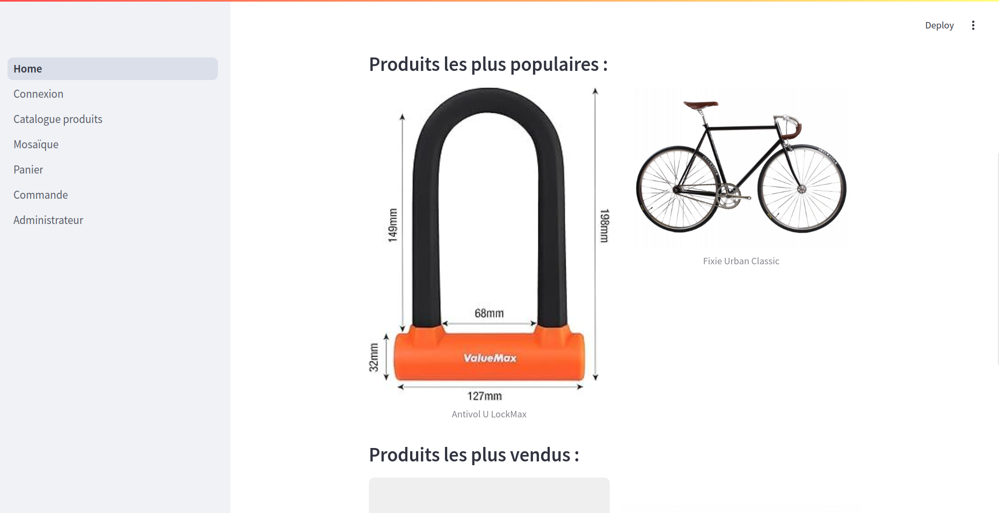
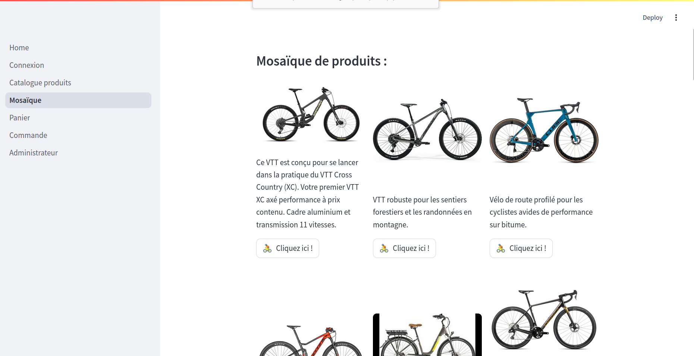
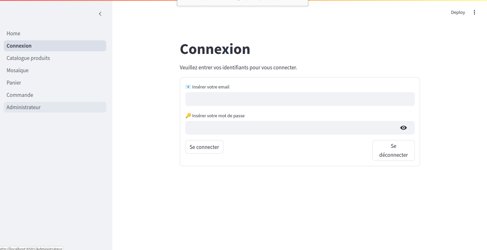
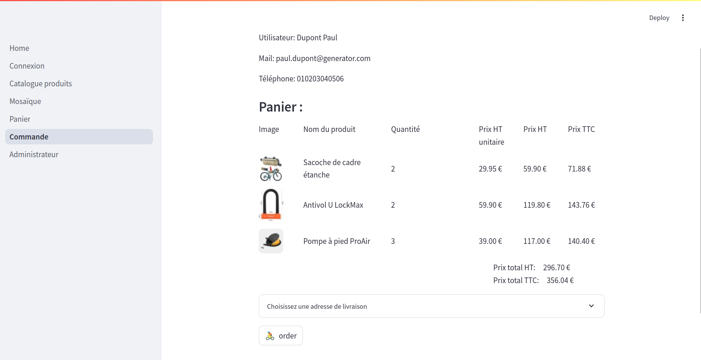
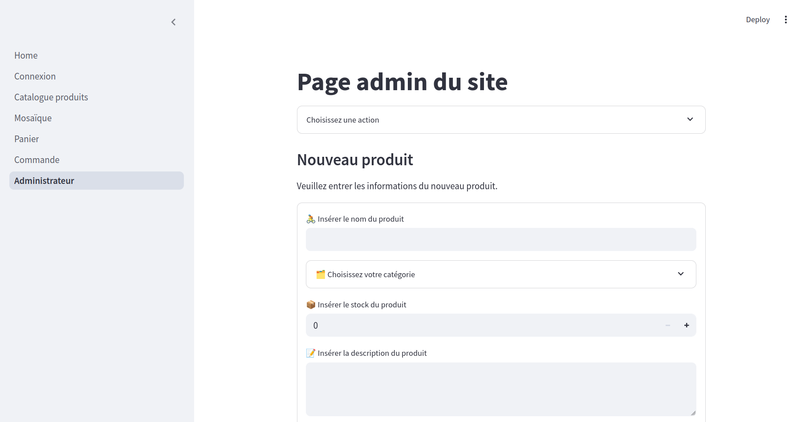
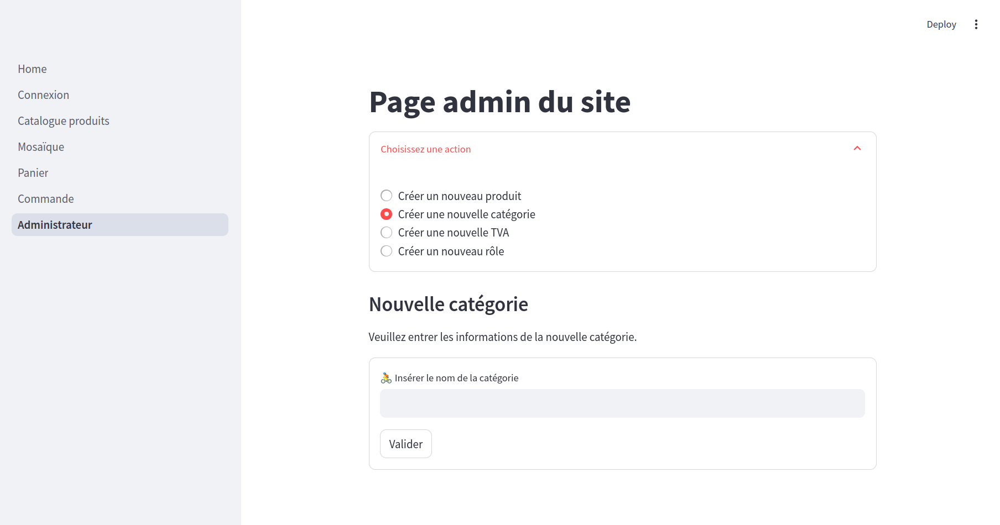
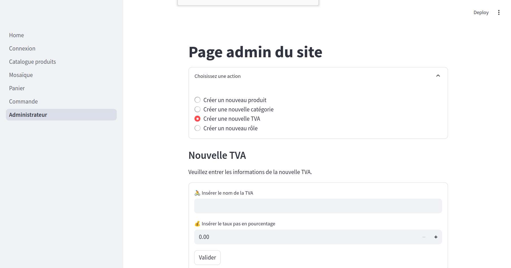
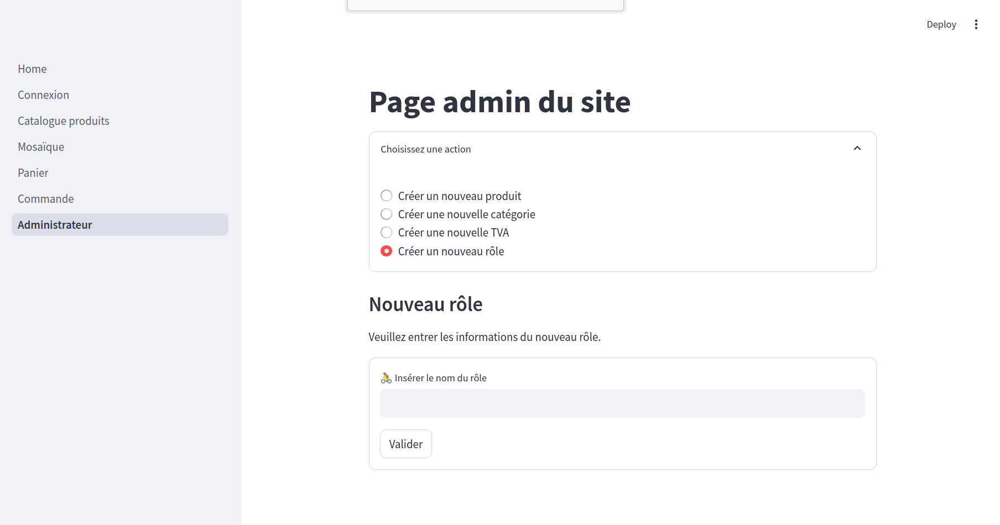

# 🚴‍♂️ dragon Bike Z eShop – Application Streamlit pour une boutiquen en ligne de vélos

par Rémi Labonne, Augustin Dendievel & César Gatano

---

Bonjour 👋,

Bienvenu dans le fichier README du projet **dragon Bike Z eShop**, une application Streamlit connectée à une base de données dédiée à la gestion d'une boutique en ligne de vélos. Derrière ce projet se cache notre apprentissage de technologies BDD, d'abord avec le SGBDR sqlite3 sous Python, puis avec la solution mongoDB pour une BDD NoSQL. Ce document vous guidera à travers les fonctionnalités de l'application et les étapes nécessaires pour commencer à l'utiliser.

 &nbsp;&nbsp;&nbsp;
 &nbsp;&nbsp;&nbsp;
  &nbsp;&nbsp;&nbsp;


---

## 🚴‍♂️ Présentation de l'application

**dragon Bike Z eShop** est une application web interactive développée avec Streamlit, conçue pour faciliter la gestion d'une boutique de vélos en ligne. Elle offre une interface conviviale permettant à des clients de visualiser les produits, de créer un panier et de commander de façon fictive les produits sélectionnés. Cette application offre également une interface simple pour administrer l'application avec des fonctionnalités
supplémentaires comme l'ajout de produits au catalogue, la gestion des stocks, ...

---

## 🛠️ Fonctionnalités client/utilisateur

- **Accueil** : Accueil sur l'application avec un aperçu des produits les plus vendus et des produits les plus populaires



- **Mosaïque** : Visualisation sous forme de mosaïque de tous les produits du catalogue.



- **Interface catalogue** : Naviguation page par page du catalogue des produits avec toutes les informations disponibles.

<video width="1280" height="480" controls>
  <source src="./assets/screenshots/Catalogue.mp4" type="video/mp4">
</video>

- **Authentification sécurisée** : Système de connexions sécurisées avec mot de passe cryptée via la technologie bcrypt



- **Création de panier**: Création automatique d'un panier dès l'ajout du premier produit
- **Gestion du panier**: Gestion du panier grâce à une page dédiée: modification des quantités, suppression d'une ligne de commande et affichage instantannée des prix HT, TTC, totaux par produit et pour le panier entier.


- **Système de commande** : Création d'une facture à partir du panier et choix de l'adresse de livraison.



---

## 🛠️ Fonctionnalités administrateur

- **Nouveau produit**: Création de nouvelles fiches produits dans la base de données nécessitant d'indiquer tous les champs requis (nom, description, spécifications techniques, stock, prix, TVA, et image).
  


- **Nouvelle catégorie de produit**: Ajout d'une nouvelle catégorie de produits. *(de base existent 'vélo' et 'accessoires')*



- **Nouvelle TVA**: Ajout d'un nouveau type de TVA nécessitant de préciser un nom et le taux appliqué. *(de base existe 'TVA française (standard) à 20%')*



- **Nouveau role**: Ajout de nouveaux roles pour les utilisateurs. *(de base existent 'utilisateurs' et 'admin')*



---

## 🚀 Installation et démarrage

Suivez ces étapes pour installer et exécuter l'application en local :

1. **Cloner le dépôt GitHub** :

   ```bash
   git clone https://github.com/StanislasComputerScience/e_bike_shop
   cd e_bike_shop
   ```
2. *(Optionnel)* **Installer mongoDB** :

   Si vous souhaitez utiliser l'application via la technologie NoSQL mongoDB, il est nécessaire de l'installer au préalable sur votre machine. Pour cela, nous nous référons au site officiel: https://www.mongodb.com/docs/manual/installation/

   - Pour Linux Ubuntu: https://www.mongodb.com/docs/manual/tutorial/install-mongodb-on-ubuntu/
   - Pour Window: https://www.mongodb.com/docs/manual/tutorial/install-mongodb-on-windows/
   - Pour MacOS: https://www.mongodb.com/docs/manual/tutorial/install-mongodb-on-os-x/
   
   *Conseil: L'installation de **mongoDB compass** est également intéressante pour visualiser la base de données en parallèle de l'utilisation de l'application: https://www.mongodb.com/products/tools/compass*

3. **Pas d'installation préalable de SQLite requise** :
   
   SQLite est intégré au package python sqlite3 et sera installé lors de l'étape 5.

4. *(Optionnel, recommandé)* **Créer un environnement virtuel** :

   ```bash
   python -m venv .venv
   source .venv/bin/activate  # Sur Windows : .venv\Scripts\activate
   ```

5. **Installer les dépendances** :

   ```bash
   pip install -r requirements.txt
   ```

6. **Création de la base de données de test** :

   - Base de données SQLite:

      ```bash
      ./scripts/create_db.sh
      ```
      La base de données de test est créée à partir du fichier `ecommerce_database.json`. Ce dernier peut-être copié-collé et adapté à vos besoins. Veillez à conserver la version
      originale de ce fichier ou à la récupérer depuis le repository sur gitHub pour toujours avoir une version fonctionnelle du fichier `ecommerce_database.json`.

      **Attention:** *En cas de test effectuée, il est probable qu'il faille supprimer le fichier
      `ecommerce_databse.json` et de le récréer avec commande ci-dessus.*

   - Base de données mongoDB:

      ```bash
      ./scripts/create_collection.sh
      ```
      La base de données de test est créée à partir du plusieurs scripts python `manager_mongodb_product.py`, `manager_mongodb_user.py`, `manager_mongodb_invoice.py`, et `manager_mongodb_metadata.py`, afin d'ajouter chaque collection, une par une.

      **Attention:** *En cas de test effectuée, pour réinitialiser le base de données à sa version initiale, réexécuter la commande ci-dessus.

7. **Exécuter l'application** :

   ```bash
   streamlit run Home.py
   ```

   ou

   ```bash
   ./scripts/run_app.sh
   ```

   L'application sera accessible à l'adresse : [http://localhost:8501](http://localhost:8501)

---

## 📁 Structure du projet

```bash
e_bike_shop/
├── Home.py                   # Point d'entrée de l'application Streamlit
├── const_values.py           # Constante utilisée par les différents programmes
├── 📁 pages/                 # Dossier contenant les pages supplémentaires
├── 📁 bdd/                   # Dossier contenant les bases de données
├── 📁 controller/            # Dossier de fonctionnalités python 
├                             #     communicantes avec la BDD SQLite
├── 📁 controller_mongod/     # Dossier de fonctionnalités python 
├                             #     communicantes avec la BDD mongoDB
├── 📁 scripts/               # Dossier de scripts bash
├── requirements.txt          # Liste des dépendances Python
├── README.md                 # Ce fichier
├── LICENSE                   # Licence du projet
├── 📁 assets/                # Ressources pour le README
├──── 📁 logo/                # Dossier de logos
├────── *.png                 # Images des logos
├──── 📁 screenshots/         # Dossier de screenshots
├────── *.png                 # Images des screenshots
└──── *.png                   # Illustrations des auteurs
```

- Les pages supplémentaires :
  
```bash
e_bike_shop/
├── 📁 pages/
├──── 1_Connexion.py          # Page de connexion
├──── 2_Catalogue_produits.py # Page de catalogues de produits avec toutes les informations
├──── 3_Mosaique.py           # Mosaïque de produits sur une seule page
├──── 4_Panier.py             # Page dédiée à la gestion du panier
├──── 5_Commandes.py          # Page de facture et du choix de livraison
└──── 6_Administrateur.py     # Page réservée aux administrateurs
```

- Les bases de données :
  
```bash
e_bike_shop/
├── 📁 bdd/
├──── ecommerce_database.json     # Instruction pour la création
├                                 # de la base de données de test (SQLite)
├──── ecommerce_database.db       # Base de données SQLite
├──── manager_db.py               # Programme de création de la base de 
├                                 # données SQLite, version test
├──── manager_mongodb_product.py  # Programme de création de la collection 
├                                 # mongoDB: Produit
├──── manager_mongodb_user.py     # Programme de création de la collection 
├                                 # mongoDB: Utilisateur
├──── manager_mongodb_invoice.py  # Programme de création de la collection 
├                                 # mongoDB: Facture
├──── manager_mongodb_metadata.py # Programme de création de la collection 
├                                 # mongoDB: Metadata
├──── 📁 assets/                  # Ressources référées par les BDD
├────── 📁 products/              # Dossier des ressources "Produits"
└────────── *.jpeg/jpg/png        # Images des différents produits
```

- Les fonctionnalités de contrôle

```bash
e_bike_shop/
├─── 📁 controller/           
├───── controller.py          # Librairie de fonctionnalités éxecutant
├                             # les requêtes SQL
├───── tools.py               # Librairie d'outils supplémentaires
├─── 📁 controller/           
├───── controller.py          # Librairie de fonctionnalités éxecutant
├                             # les requêtes mongoDB
└───── tools.py               # Librairie d'outils supplémentaires
```

- Les scripts bash:

```bash
e_bike_shop/
├─── 📁 scripts/
├───── run_app.sh             # Lance l'application streamlit
├───── remove_db.sh           # Supprime la base de données SQLite
├───── create_db.sh           # Crée la base de données SQLite
├                             # à partir du fichier json
└───── create_collection.sh   # Crée la base de données mongoDB
                              # (supprime l'existante)
```

---

## 🔄 Permutation entre technologies SQLite et mongoDB

Pour passer de l'utilisation d'une base données gérée par SQLite ou par mongoDB il est nécessaire de changer la valeur dans le fichier `const_values.py`

```python
BDD_TECHNO = "mongodb"
```

ou 

```python
BDD_TECHNO = "sqlite"
```

---

🚴‍♀️💨 Merci d'avoir choisi **dragon bike Z eShop** pour gérer votre boutique en ligne de vélos ! 🚴‍♀️💨
